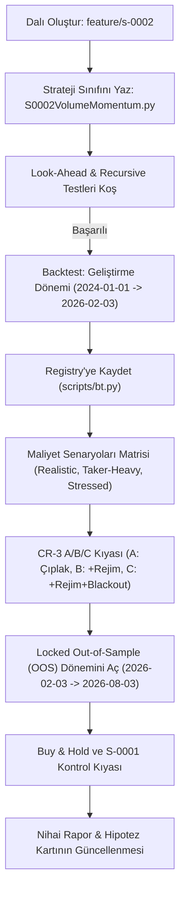

# Implementation Plan — ADR-0004 & S-0002 (Kart A) Strateji Geliştirme Planı

Bu belge, CR-002 yol haritası Adım 6 kapsamındaki **S-0002 (Hacim-Koşullu Intraday Momentum, Kart A)** stratejisinin uygulanması öncesinde kullanıcı onayına sunulan **ADR-0004 Taslağını** ve **S-0002 Uygulama Planını** içermektedir.

> [!IMPORTANT]
> **Kural Uyarısı:** Bu plan onaylanmadan hiçbir strateji kodu yazılmayacak ve `main` dalına commit atılmayacaktır. Kod geliştirmesi `feature/s-0002` dalı üzerinde yürütülecektir.

---

## (a) ADR Taslağı: ADR-0004 (Görev Başına Tek Yazar ve Bağımsız İnceleme İlkesi)

### Başlık: `ADR-0004: Görev Başına Tek Yazar ve Bağımsız İnceleme İlkesi`

#### Durum
DRAFT (Onay Bekliyor)

#### Bağlam ve Problem
`CLAUDE.md` §3 Oturum akışı Kural 3'te *"Bu repo tek yazarlıdır (Claude Code). Başka araç çıktıları yalnız inceleme girdisidir; doğrudan merge edilmez."* ifadesi yer almaktadır. 

Ancak AI destekli geliştirme süreçlerinde, aynı oturumun veya aynı modelin kendi yazdığı koda tarafsız bakamama (doğrulama yanlılığı / confirmation bias) riski bulunmaktadır. Kodun yazımı ile inceleme/denetim sorumluluğunun ayrıştırılması, projenin determinizm, test edilebilirlik ve look-ahead bias koruması ilkelerini güçlendirecektir.

#### Karar
`CLAUDE.md` §3 Kural 3 ifadesi şu şekilde güncellenecektir:
> **"Görev başına tek yazar; yazar ≠ incelemeci."**
> Her geliştirme görevi tek bir yazar rolü tarafından yürütülür. Kod geliştirmesini yapan oturum/model, kendi kodunun nihai kabul denetçisi olamaz. İnceleme; bağımsız bir AI oturumu, farkı bir model (örn. Cursor/Codex/Gemini) veya insan denetçi tarafından yürütülen inceleme ve kabul kapıları (`lookahead-analysis`, `recursive-analysis`, `pytest`) ile tamamlanır.

#### Gerekçe
1. **Tarafsız İnceleme:** Yazım anında yapılan varsayımsal veya mantıksal hataların aynı oturum/model tarafından gözden kaçırılması engellenir.
2. **Görev Ayrılığı (Separation of Concerns):** Yazar "işlevsellik ve hipotez dürüstlüğü"ne, incelemeci ise "anti-desenler, look-ahead bias, test kapsamı ve mimari uyum"a odaklanır.

#### Riskler
1. **Mimari Tutarsızlık:** Geliştirmeyi yapan modelin mevcut kod konvansiyonlarından ve yapısından uzaklaşması riski.
2. **Konvansiyon Kayması (Convention Drift):** `CLAUDE.md` ve `SINYAL-SPEC.md` kurallarının (örn. mutlak eşik yasakları, global normalizasyon yasakları) yeni strateji dosyalarına sızması.
3. **Look-Ahead Bias Sızıntısı:** İncelemecinin freqtrade özel anti-desenlerini (kapanmamış mum kullanımı, hatalı HTF birleştirme) gözden kaçırması.

#### Önlemler ve Kontroller
1. **Feature Branch Zorunluluğu:** Tüm kodlama `feature/<görev-adı>` (örn. `feature/s-0002`) dalında yapılacak; `main` dalına doğrudan commit atılmayacaktır.
2. **Mevcut Desenlere Tam Uyum:** `S0001EmaCross.py`, `CLAUDE.md` ve `SINYAL-SPEC.md` mimari kalıpları harfiyen referans alınacaktır.
3. **Pazarlıksız Otomatik Kabul Kapıları:** PR veya birleştirme öncesi `lookahead-analysis`, `recursive-analysis`, `ruff` ve `pytest` çalıştırılacak ve sonuçları hipotez kartına işlenecektir.

---

## (b) S-0002 Uygulama Planı (Hacim-Koşullu Intraday Momentum, Kart A)

### 1. Hipotez Kartı Taslağı (`docs/hypotheses/S-0002.md`)

```markdown
# S-0002 — Hacim-Koşullu Intraday Momentum Stratejisi (Kart A)

| Alan | Değer |
|---|---|
| Durum | TASLAK (Geliştirme Aşaması) |
| Kanıt düzeyi | Orta-Yüksek (Wen, Bouri, Xu ve Zhao, 2022) |
| Varlıklar | BTC/USDT:USDT (Ana Kalibrasyon), ETH/USDT:USDT (Bağımsız Doğrulama) |
| Zaman dilimi | 15m (Ana Sinyal), 1h (Rolling Pencere / Hacim Bağlamı) |
| Serbest parametre | 5 / 6 (return_percentile, volume_mult, holding_candles, atr_period, atr_stop_mult) |

## Hipotez (tek paragraf)
Bitcoin ve Ethereum vadeli işlemlerinde kısa vadeli getiriler, yüksek hacim ve katılımın eşlik ettiği dönemlerde momentum (trendin devamı) davranışı gösterir. Strateji, son 1 saatlik (4 mum) toplam getirinin aynı UTC saatindeki tarihsel dağılımda yüksek bir persentilde olması ve 1 saatlik hacmin tarihsel medyanın üzerinde gerçekleşmesi koşuluyla kırılma yönünde pozisyon açar. Sabit sayısal eşikler yerine dinamik/göreli rolling persentiller kullanılarak piyasa etkinliğinin zamansal değişimine uyum sağlanır.
```

### 2. Gereken Veri Sütunları ve Hazırlık Durumu

| Veri Sütunu / Metrik | Hesaplama / Tanım | Freqtrade Durumu | Ek İndirme / İşlem Gereksinimi |
|---|---|---|---|
| `open`, `high`, `low`, `close`, `volume` | 15m OHLCV verisi | **HAZIR** | `freqtrade download-data -t 15m` |
| `return_4bar` | `(close - close.shift(4)) / close.shift(4)` | **HAZIR** | Strateji `populate_indicators` içinde hesaplanır |
| `volume_1h` | `volume.rolling(4).sum()` | **HAZIR** | Strateji `populate_indicators` içinde hesaplanır |
| `volume_1h_median_60d` | Aynı UTC saatinin son 60 gündeki rolling medyanı | **HAZIR** | `rolling()` pencereli gruba göre medyan |
| `return_4bar_pct_rank` | Son 4 mum getirisinin son 60 gündeki rolling persentili | **HAZIR** | Global normalizasyon YASAK; yalnız `rolling(window)` |
| `atr` | `ta.ATR(dataframe, 14)` | **HAZIR** | TA-Lib kütüphanesi ile hesaplanır |
| Historical Funding Rate | Tarihsel 8h/1h funding oranı serisi | **HAZIR** | `download-data --trading-mode futures` ile indirildi |

> [!CAUTION]
> **Look-ahead ve Normalizasyon Yasağı:** `return_4bar_pct_rank` ve `volume_1h_median_60d` hesaplanırken tüm DataFrame üzerinde `.min()`, `.max()` veya `MinMaxScaler().fit_transform()` KULLANILMAYACAKTIR. Sadece geçmişe dönük `rolling()` pencereleri kullanılacaktır.

---

### 3. Giriş ve Çıkış Koşulları (Kart A'dan Türetilmiş Göreli Kurallar)

#### Giriş Koşulları (Long — `enter_long`)
1. **Getiri Momentum Koşulu:** Son 4 mumun toplam getirisi (`return_4bar`), son 60 günlük rolling dağılımda tanımlanan persentil eşiğinin üzerindedir:
   $$\text{return\_4bar\_pct\_rank} \ge \text{return\_percentile} \quad (\text{varsayılan: } 0.80)$$
2. **Hacim Teyit Koşulu:** Son 1 saatlik hacim (`volume_1h`), aynı saat diliminin 60 günlük rolling medyanının belirlenen çarpanından büyüktür:
   $$\text{volume\_1h} \ge \text{volume\_mult} \times \text{volume\_1h\_median\_60d} \quad (\text{varsayılan: } 1.25)$$
3. **Kırılma Koşulu:** Son mum kapanışı (`close`), önceki 1 saatlik bar aralığının (`high.shift(1)`) üzerindedir:
   $$\text{close} > \text{high\_1h\_shift1}$$
4. **Etiketleme (`enter_tag`):** `"mom_vol_breakout_long"`

#### Giriş Koşulları (Short — `enter_short`)
1. **Düşüş Momentum Koşulu:** Son 4 mumun toplam getirisi, son 60 günlük rolling dağılımda en düşük %20'lik dilimdedir:
   $$\text{return\_4bar\_pct\_rank} \le (1.0 - \text{return\_percentile}) \quad (\text{varsayılan: } 0.20)$$
2. **Hacim Teyit Koşulu:** $\text{volume\_1h} \ge \text{volume\_mult} \times \text{volume\_1h\_median\_60d}$
3. **Kırılma Koşulu:** $\text{close} < \text{low\_1h\_shift1}$
4. **Etiketleme (`enter_tag`):** `"mom_vol_breakout_short"`

#### Çıkış Koşulları (`exit_long`, `exit_short`, `custom_stoploss`)
1. **Fiyat Yapısı Çıkışı:** Long için son 2 mumun düşüğünün altına inilmesi (`close < min(low[-1], low[-2])`); Short için son 2 mumun yükseğinin üzerine çıkılması.
2. **Zaman Bazlı Çıkış (`time_exit`):** Pozisyon süresi 4 mumu (1 saat) doldurduğunda otomatik çıkış tetiklenir (`enter_bar_index + 4 <= current_bar_index`).
3. **Zarar Durdurma (`custom_stoploss`):** Chandelier ATR(14) $\times$ `atr_stop_mult` (varsayılan 1.0 ATR). freqtrade yalnız lehte trailing sıkılaştırması yapar.

---

### 4. Parametre Listesi (Serbest Parametre Sayısı: 5 $\le$ 6)

| Parametre Adı | Türü | Varsayılan | Arama Aralığı (Hyperopt) | Optimize Edilecek mi? |
|---|---|---|---|---|
| `return_percentile` | DecimalParameter | 0.80 | 0.70 — 0.90 | Evet (Train döneminde) |
| `volume_mult` | DecimalParameter | 1.25 | 1.10 — 1.50 | Evet (Train döneminde) |
| `holding_candles` | IntParameter | 4 | 2 — 8 | Evet (Train döneminde) |
| `atr_period` | IntParameter | 14 | 7 — 28 | Hayır (Sabit 14) |
| `atr_stop_mult` | DecimalParameter | 1.0 | 0.5 — 2.5 | Evet (Train döneminde) |

*Not:* `lookback_days` = 60 olarak sabit tutulacak, overfit riskini azaltmak için serbest parametre yapılmayacaktır.

---

### 5. Backtest ve Doğrulama Koşu Planı



#### Adım Adım İcra Süreci:
1. **Dalgıçlık ve Kodlama:** `git checkout -b feature/s-0002` dalı açılacak, `user_data/strategies/S0002VolumeMomentum.py` dosyası yazılacak.
2. **Kabul Kapısı (Anti-Desen Testleri):**
   - `freqtrade lookahead-analysis --strategy S0002VolumeMomentum`
   - `freqtrade recursive-analysis --strategy S0002VolumeMomentum`
3. **Backtest Koşuları (Experiment Registry Entegre):**
   - Geliştirme dönemi (2024-01-01 → 2026-02-03) üzerinde `--timeframe-detail 1m` ve `config/costs.yaml` ile test.
   - `scripts/bt.py` üzerinden her koşu `registry/experiments.jsonl` dosyasına yazılacak.
4. **Maliyet Senaryo Analizi:** `realistic`, `taker_heavy`, `stressed` senaryoları altında performans ölçümü.
5. **Locked Out-of-Sample (OOS) Kilidinin Açılması:**
   - 2026-02-03 → 2026-08-03 dönemi **yalnızca 1 kez** çalıştırılacak. 
   - OOS çalıştırıldıktan sonra strateji üzerinde hiçbir parametre değişikliği yapılmayacaktır.
6. **ETH Başıboş (OOS) Doğrulaması:** BTC'de kalibre edilen parametreler ETH/USDT:USDT üzerinde doğrudan denenip bağımsız doğrulama seti olarak raporlanacaktır.

---

## Kullanıcı Onayı ve Sonraki Adım

Yukarıda sunulan **ADR-0004 Taslağı** ve **S-0002 Uygulama Planı** incelenip onaylandıktan sonra:
1. `feature/s-0002` dalı oluşturulacak,
2. `docs/adr/0004-tek-yazar-ve-bagimsiz-inceleme.md` ve `docs/hypotheses/S-0002.md` dosyaları oluşturulacak,
3. `user_data/strategies/S0002VolumeMomentum.py` stratejisi kodlanacak ve backtest adımlarına geçilecektir.

*Lütfen devam etmem için planı onayladığınızı belirtin.*
